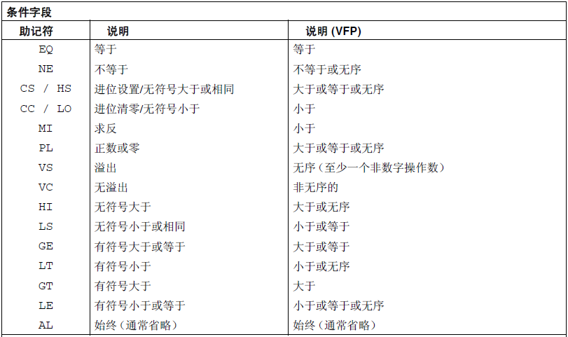

# ARM指令简介

## ARM指令格式及简单范例

一般的算术运算ARM指令通常是由如下的形式组成的：

```asm
MNEMONIC{S}{condition} {Rd}, Operand1, Operand2
```

其中，由`{}`包起来的部分属于可选部分。

尤其要注意的是，这只是一个大概的表示形式。并不是所有指令都用到了其中的所有字段，对于特定的指令，只有其中的一部分可选字段对该指令有效。

其中不同字段的大致解释如下：

|字段|介绍|
|:-:|:-|
|MNEMONIC|指令助记符|
|{S}|可选后缀，假设在算术运算指令后加上了一个S，那么APSR寄存器中的各标志位就会根据该指令的运算结果进行更新|
|{condition}|可选后缀，假如在指令后加上了一个条件那么该指令只有当此条件满足时才会执行|
|{Rd}|可选字段，放置指令结果的目的寄存器|
|Operand1|第一操作数，既可以是一个寄存器，也可以是一个立即数|
|Operand2|第二操作数，该操作数比较灵活，可以是立即数、或者进行可选移位的寄存器|

对于第二操作数，举几个例子：
|操作数|解释|
|:-|:-|
|#123|立即数，前面要加#号表示（立即数的表示范围是被限制的，原因会在后面详细说明）|
|Rx|寄存器x|
|Rx, ASR n|取寄存器x的值后算术右移(Arithmetic Shift Right)n位，n在[1,32]区间|
|Rx, LSL n|取寄存器x的值后逻辑左移(Logical Shift Left)n位，n在[0,31]区间|
|Rx, LSR n|取寄存器x的值后逻辑右移(Logical Shift Right)n位，n在[1,32]区间|

来看一看具体的指令：
|指令|解释|
|:-|:-|
|ADD R0, R1, R2|把R1+R2的结果送到R0|
|ADD R0, R1, #2|把R1+2（立即数）的结果送到R0|
|MOVLE R0, #5|当LE的条件成立时（小于等于），将立即数5传送到R0中|
|MOV R0, R1, LSL #1|将R1做逻辑左移1位后的值送到R0|

## 立即数表示范围

在ARM指令中，对于用`#`表示的立即数来说，它们的范围是受限制的。在另一个RISC指令集MIPS中，立即数的范围也是受限制的，但是它们的受限方式有所不同。

对于MIPS指令集，立即数字段占16Bits，因此要表示的立即数只能在16Bits所能够表示的范围之内。而ARM的立即数表示方法比较奇特。立即数字段在整条指令中仅占12Bits。ARM的设计者将12Bits的空间分为8Bits和4Bits，其中8Bits的空间用来存储0~255之内的立即数。而剩下的4Bit用来存储对该立即数循环右移(Rotate Right, ROR)的位移量，范围在0到30之间（步长为2，只能是偶数）。因此，这些立即数的表示范围是受限的。使用`#`指令不能表示所有的立即数。

假设你在使用立即数时出错，超出了机器指令能够表示范围，汇编器会给你一个提醒，告诉你这个立即数是无法嵌入到指令中去的。

但是对于单纯的寄存器加载立即数而言，有一种伪指令可以替代这种加`#`号的表示方式。它是`LDR Rx, =IMM`。这条伪指令可以将`IMM`的值加载到寄存器`Rx`中而无论`IMM`是否符合立即数的要求。这是因为汇编器会将该伪指令翻译为多条加载指令和相加指令的总和。从而巧妙地避开这个问题。

对于在其他指令中使用立即数而又导致立即数格式错误的问题，建议先用`LDR`指令把立即数加载进寄存器再使用寄存器进行操作。

## 条件后缀字段表

下面是一些算术运算指令后可以添加的条件后缀：



## 第二操作数可选移位类型

下面是第二操作数可选移位类型表：

|第二操作数格式|解释说明|
|:-|:-|
|省略移位指令|不移位，与`LSL #0`等价|
|`LSL #<n>`|逻辑左移n位，n在[0,31]区间|
|`LSR #<n>`|逻辑右移n位，n在[1,32]区间|
|`ASR #<n>`|算数右移n位，n在[1,32]区间|
|`ROR #<n>`|循环右移n位，n在[1,31]区间|
|`RRX`|特殊的1位循环右移，bit[0]写入`shifter_carry_out`，bits[31:1]右移1位，进位标志(Carry Flag)写入bit[31]|

循环右移：是指将从右面移出去的位补到该数的最左面。

## 其他重要指令简介

请参阅`A1.ARMInstTable.md`。