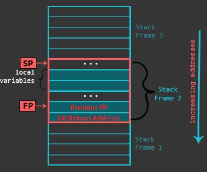

# 函数和调用约定

## 栈

在前面的教程中，简要的提到了什么是栈。什么是帧指针FP，什么是栈指针SP。

先来介绍栈帧的定义：对于一个函数，在栈中占用的整块空间的总和（包括局部变量、返回地址、调用参数等）叫做**栈帧(Stack Frame)**。

在这里，根据栈帧进一步明确前几部分中提到的定义，帧指针FP是指向当前栈帧底部的指针，栈指针是指向当前栈帧底部的指针。

接下来我们来大致了解一下，在程序运行的具体过程中，栈的排布情况。

下面是一张展示栈的布局的图片：



根据这张图片，首先要明确的是，栈是由高地址向低地址增长的。

然后，由图片可以看出，当前FP指针所指的恰好是上一函数的FP指针存储的位置，再往下是当前函数的返回地址。FP指针的上面存储了一些局部变量。在整个栈帧的最上面是SP指针所指的位置。

初次接触这些可能会比较难以理解，我们下面将会通过一个通用的函数模板来对其有一个更深入的了解。

## 函数

在汇编语言中，函数一般包括如下三个部分：

- **保护现场**
- **函数体** （不做重点讲述）
- **恢复现场**

### 保护现场

保护现场的目的是为了保存上一个函数的各类运行状态（尤其包括保存LR寄存器中的返回地址和帧指针FP）。除此之外还要为当前函数分配栈上的运行空间。

下面是一个典型的保护现场的汇编代码：
```asm
push   {fp, lr}  /* 将FP和LR存入栈帧底部 */
add    fp, sp, #0  /* 设置新的FP */
sub    sp, sp, #16  /* 为当前函数分配栈上的运行空间 */
```
执行完毕后，栈帧的情况恰好与上面栈的布局的图片一致。

### 恢复现场

恢复现场首先要释放当前函数分配的栈上运行空间，再将各寄存器恢复到上一个函数的状态。

下面是一个典型的保护现场的汇编代码：（这个代码与上面的保护现场的代码是配套的）
```asm
sub    sp, fp, #0  /* 恢复原本的SP指针，此处的立即数要与保护现场中第2条指令中的立即数一致 */
pop    {fp, pc}    /* 恢复原本的FP指针，将LR寄存器的返回地址写到PC中 */
```

## 调用约定

调用约定，是讲述函数传参及调用函数时保存寄存器的规则。

对于寄存器R11~R15来说，它们都是有特殊用途的寄存器。在程序运行的过程中，任何时候都不能随意更改它们的值。

寄存器保存规则：

**调用者保存(Caller Save)**：调用新函数之前，如果某一寄存器在将来还需要使用，那么当前函数应该自己保存该寄存器的值。待要使用的时候再进行恢复。

**被调用者保存(Callee Save)**：如果当前函数需要使用一个寄存器存放数据，那么在使用该寄存器前应该把寄存器之前的内容先存储起来。在当前函数返回之前把该寄存器的内容恢复。

下面列表陈述从R0~R10各寄存器的用途及约定：
|寄存器名|寄存器保存规则|特殊说明|
|:-|:-|:-|
|R0|调用者保存|传入函数参数1，返回值寄存器1|
|R1|调用者保存|传入函数参数2，返回值寄存器2|
|R2|调用者保存|传入函数参数3|
|R3|调用者保存|传入函数参数4|
|R4|被调用者保存||
|R5|被调用者保存||
|R6|被调用者保存||
|R7|被调用者保存||
|R8|被调用者保存||
|R9|被调用者保存||
|R10|被调用者保存||

在设计编译器时，用到了哪个寄存器就要根据相应的保存规则对寄存器加以保护。最无脑的保护方法就是一股脑的一次性把全部寄存器全部保护起来，这样比较省事。

如果传参多于4个，就要使用栈进行传参。

SP要保证按双字对齐。即`SP%8==0`。

这里只简单陈述了最简单的调用约定并且对其做了适当的简化，如果涉及到更复杂的调用约定，请参阅`README.md`中的ARM官方调用约定手册。